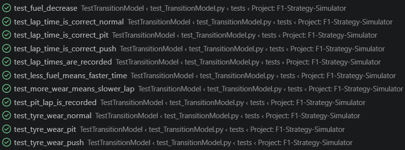
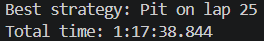
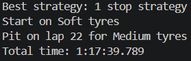

# F1 Strategy Simulator

## Project Intro

This project will calculate the best strategy for an F1 race using a variety of different pieces of data, including tyre wear, fuel loads and lap counts, finding optimal pit windows and tyre choices.
The core of this project is a Markov Decision Process and value iteration, to find the optimal policy (strategy) under uncertainty.

## Planned Features

* Varied, and extensive input data
* Realistic Lap-by-lap transition model
* Use of MDPs
* Basic UI
* Database usage
* Using real world data

## The Strategy Search

The first prototype of the strategy search could only consider one-stop strategies, and only one compound of tyre.
Now, the strategy search engine can find the optimal one, two or three stop strategy, and considers soft, medium and hard tyres, with different stats.
It can find the optimal strategy across five different tracks - Monaco, Monza, Silverstone, Bahrain and Spa. Each track has different stats, interacting with pace, tyre wear and fuel burn
It brute force tests every possible strategy (tyre combinations, and pit laps), and returns the strategy with the best time.

## Mathematical modelling

Tyre wear and fuel burn both use non-linear models, that feed into themselves and each other. Tyres that are more worn increase in wear faster, more fuel increases tyre wear, less fuel means a lighter car so less fuel is used per lap. Softer tyres and pushing more will multiplicatively increase fuel burn and tyre wear

## Project Roadmap

I plan to build this in an agile manner, producing multiple prototypes from the ground up. 
The first prototype is simply be a brute force search, a one-stop strategy, linear models, and no regard to tyre compounds.
The second incorporates logic for multi-stop strategies and multiple tyre compounds.
Further prototypes will use better models, calculate when to push or conserve fuel and tyres, and use MDPs as the main strategy search engine.

**Current Status: Implementing different track models**

## Testing

This project uses Python's built-in unittest framework.
Tests cover the transition model (tyre wear, fuel load, lap time, pit stops) to ensure the simulation behaves predictably, and the strategy search to ensure that all strategies are valid simulated.

## How to run

python main.py

## Prototype 1 example output

## Prototype 2 example output

